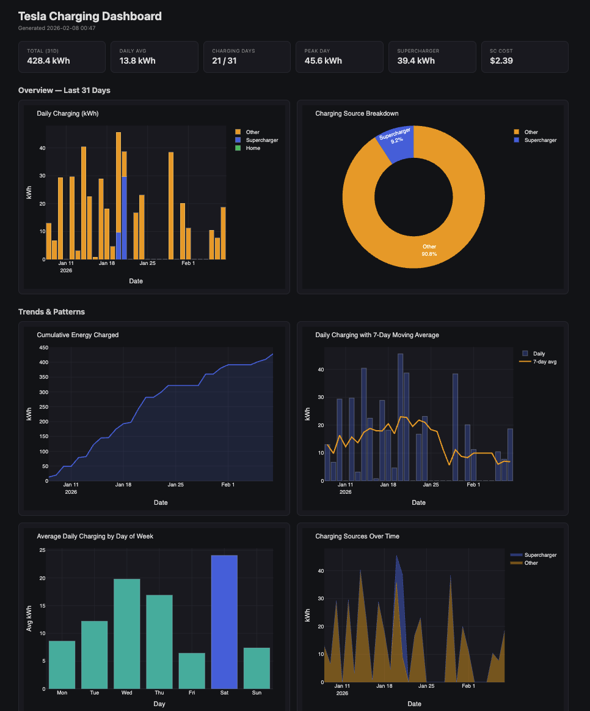

# Tesla Charging Dashboard

A Python tool that fetches charging data from the Tesla API and generates a self-contained HTML dashboard with interactive Plotly charts.

## Demo



## Features

- Fetches both V1 (daily aggregated) and V2 (per-session Supercharger) charging history
- Generates a dark-themed, responsive HTML dashboard with no external dependencies
- Summary cards showing totals, daily averages, peak usage, and costs
- Charts include:
  - Daily charging breakdown (home / Supercharger / other)
  - Charging source donut chart
  - Cumulative energy and 7-day rolling average
  - Day-of-week patterns and heatmaps
  - Supercharger session timelines (energy, cost, duration)
  - Cost vs energy bubble chart
  - Top Supercharger locations
  - Monthly spending trends

## Setup

```bash
python -m venv venv
source venv/bin/activate
pip install -r requirements.txt
```

## Usage

**Fetch live data and generate the dashboard:**

```bash
python fetch_and_render.py --email your@tesla.com
```

On first run, a browser window opens for Tesla login. The auth token is cached in `cache.json` for subsequent runs.

**Render from cached data (offline):**

```bash
python fetch_and_render.py --offline
```

**Dump raw API responses for inspection:**

```bash
python fetch_and_render.py --email your@tesla.com --discover
```

The generated dashboard is saved to `output/dashboard.html`. Open it in any browser.

## Dependencies

- [TeslaPy](https://github.com/tdorssers/TeslaPy) — Tesla API client
- [Plotly](https://plotly.com/python/) — interactive charts
- [Pandas](https://pandas.pydata.org/) — data processing
